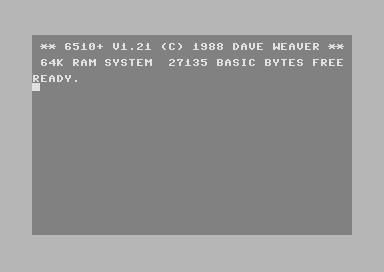
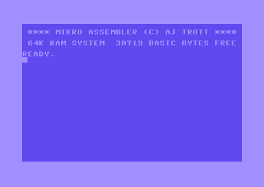

# 6510+
An updated / improved version of the Mikro Assembler cartridge for the Commodore 64 was released FREE with the Commodore Disk User Magazine Vol.2 Issue 4 published May/June 1989.
This version is called 6510+, the 6510+ assembler loads from disk and does not require a cartridge. 
The files (Magazine PDF and .d64 image) are located in the 6510+ directory. 
The 6510+ directory contains the .d64 disk image as released with the magazine, the assembler program file is called 6510+ and the instructions on how to use the assembler as well as more advanced technical details concerning memory locations that are used / reserved by the assembler are included in the magazine (PDF file also in the 6510+ directory). 
It should be noted that a disk file based version of Mikro was also separately released by the cracking group "The Silents".

You can directly load the assembler from the disk typing LOAD"6510+",8,1, once the file is loaded you type SYS64738, to run the assembler.
Also you can load 6510+ via the main menu system on the disk (by loading the first file on the disk and then selecting 6510+). 
ENJOY :) 

!

This Fork also contains the original files for Mikro Assembler as described below:

## Mikro Assembler

## Introduction

The Mikro Assembler is a cartridge for the Commodore 64/VIC 20, released by Supersoft in the early 1980s and written by Andrew J Trott. It offers a unique way to write assembly code, using line numbers like writing BASIC code. The cartridge allows users to `LOAD`, `SAVE`, and `VERIFY` their code to disk or tape, and it includes a machine code monitor called `TIM`.

## Downloads

The following items are available for download from this repository:

* [Mikro Assembler Cartridge (modified with correct cartridge ID for emulators)](downloads/cartridges/Mikro%20Assembler%20[vice].crt)
* [Mikro Assembler Cartridge (original cartridge dump)](downloads/cartridges/Mikro%20Assembler.crt)
* [Multi Easy Easyflash Cartridge](downloads/cartridges/Multi-Easy.crt) by [Lord Crass](https://csdb.dk/scener/?id=25177), includes a version of the Mikro Assembler that works on my hardware. ([source](https://csdb.dk/release/?id=117893)).
* [Mikro Assembler Manual](downloads/Mikro%20Assembler%20Manual.pdf)

## Usage

* [List of BASIC Commands](Basic%20Commands.md)
* [List of Pseudo Opcodes](Pseudo-Ops.md)
* [Machine Code Monitor Commands](Machine%20Code%20Monitor%20Commands.md)

## Examples

The following examples demonstrate how to use the Mikro Assembler:

* [Hello World](examples/helloworld.md)
* [Hello World Inline](examples/helloworldinline.md)
* [10 PRINT](examples/10PRINT.md)
* [Border Colour](examples/borcol.md)
* [Key Beep](examples/keybeep.md)
* [Renumber](examples/renumber.md)
* [ASCII Organ](examples/asciiorgan.md)

You can download a disc image with the source code and assembled files for these examples from [examples.d64](examples/examples.d64).

## Summary

This repository provides everything you need to get started with the Mikro Assembler, including downloads of the cartridge, manual, and example code. With the Mikro Assembler, you can write assembly code using a familiar BASIC-style interface and take advantage of its built-in machine code monitor. Try it out for yourself!

